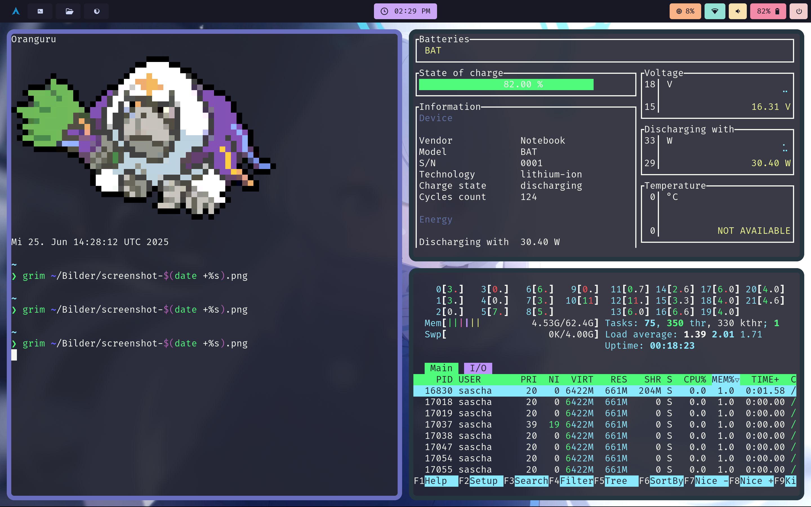

## creadits
### https://github.com/addy-dclxvi/i3-starterpack
### https://github.com/jameswylde/wypr-hyprland
### https://github.com/sameemul-haque/dotfiles
### https://github.com/dracula
### https://github.com/prbhtkumr/rofi-radio

## pic 

## it is my config for swayfx, bash, foot, kitty, nvim, qutebrowser, rofi, waybar, wlogout, yazi, newsboat

